# Fluxograma completo do bot_rotina

**Fachada:** [`app/bots/bot_rotina.py`](../app/bots/bot_rotina.py) (re-exporta API pública)  
**Implementação:** pacote [`app/bots/rotina/`](../app/bots/rotina/)

```
app/bots/rotina/
├── constants.py          # TASK_*, colunas, timeouts
├── state.py              # BotRuntime, exec_summary
├── notifications.py      # Teams adaptive cards
├── csv_merge.py          # CSVReader, MergeInteligente
├── io.py                 # parquet, downloads, utilitários CSV
├── selenium_brflow.py    # login Okta, navegação BRFlow
├── orchestration.py      # start, stop, executar_novo_bot, _executar_ciclo
└── tasks/
    ├── __init__.py       # TASK_REGISTRY + execute_task
    ├── detalhado.py      # BRBR-4467 (1d/2d/3d)
    ├── produtividade.py  # produtividade D-1
    ├── auditoria.py      # replicados D1, etapas
    ├── monitor.py        # monitor eventos + tratar_arquivo
    ├── confer.py         # produção Confer, log eventos
    └── unificados.py     # prod_unificado, monitor_unificado
```

**Entrada em produção:** `robot_runner.py --mode rotina` → `start(settings)`  
**Entrada direta:** `python -m app.bots.bot_rotina` → `executar_novo_bot()` (sem agendador)

---

## 1. Fluxo macro (orquestração)

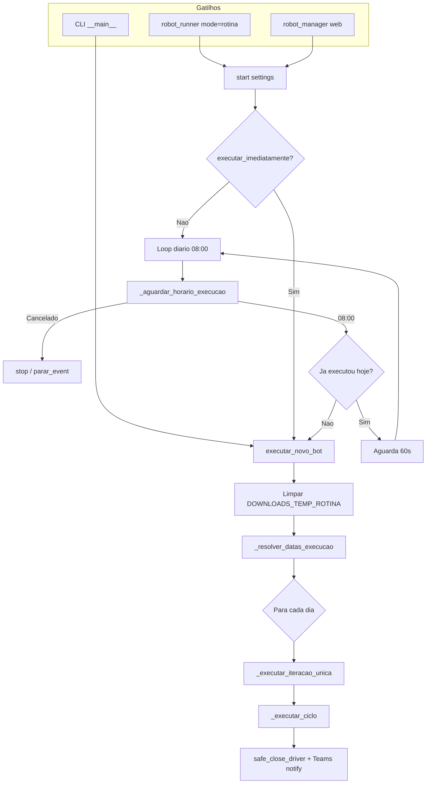

### Detalhes da orquestração

| Etapa | Função | Linhas | Comportamento |
|-------|--------|--------|---------------|
| Agendamento | `start()` | 3241–3326 | Modo imediato (1x) ou loop 08:00 com anti-duplicata |
| Período | `_resolver_datas_execucao()` | 3201–3239 | `rotina_data_inicio` / `rotina_data_fim` ou dia único |
| Dia único | `_executar_iteracao_unica()` | 3422–3478 | Define `ROTINA_DATA_EXECUCAO`, métricas, notificação |
| Ciclo Selenium | `_executar_ciclo()` | 3583–3727 | Driver → login → BRFlow → loop de tarefas |

**Notificação final:** sucesso se `execucao_sucesso` e sem erros em `_exec_summary`; caso contrário, Teams com lista de erros (até 10).

---

## 2. Fluxo do ciclo Selenium e tarefas

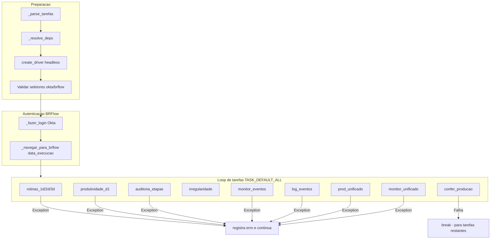

### 12 tarefas e handlers

| ID | Handler | Tratamento |
|----|---------|------------|
| `rotinas_1d/2d/3d` | `_baixar_e_combinar_rotinas` | Download BRBR-4467 + consolidação + merge Parquet |
| `produtividade_d1` | `_baixar_produtividade_d1` | Download + `tratar_produtividade` |
| `auditoria_etapas` | `_baixar_auditoria_etapas` | Download + Parquet (sem tratamento BI) |
| `irregularidade` | `_baixar_irregularidade_ged` | Nova aba GED: Pos-Venda → Relatório de Irregularidades (15 dias, D-1) + CSV tratado |
| `monitor_eventos` | `_baixar_monitor_eventos_d1` | Download + `tratar_arquivo` (se prod D-1 existe) |
| `confer_producao` | `_baixar_relatorio_producao_confer` | Re-login Confer + `_tratar_producao_confer_df` |
| `log_eventos` | `log_eventos` | Por matrícula + consolidação sessões |
| `prod_unificado` | `_juntar_confer_prod_tratados_dia` | Join prod-tratada + confer-tratado |
| `monitor_unificado` | `_juntar_monitor_tratado_com_monitor_confer_dia` | Join monitor-tratado + confer-monitor |

### Grafo de dependências (auto-injetadas por `_resolve_deps`)

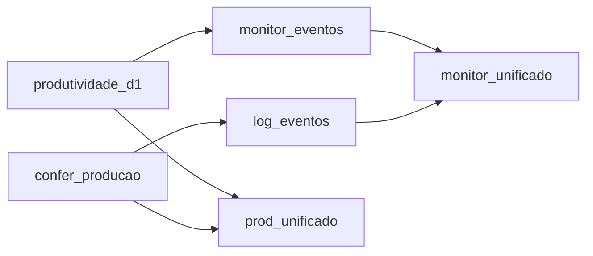

Independentes: `rotinas_1d`, `rotinas_2d`, `rotinas_3d`, `auditoria_etapas`, `irregularidade`.

---

## 2.1 Sub-fluxo: Irregularidade GED

Task `irregularidade` abre o portal GED em **nova aba** (credenciais `GED_USER` / `GED_PASS`), independente do menu BRFlow.

```mermaid
flowchart TD
    Start[_baixar_irregularidade_ged] --> Tab[Nova aba GED]
    Tab --> Login[Login GED]
    Login --> Loop[Para cada quinzena 1/2]
    Loop --> Menu["Pos-Venda → Relatório de Irregularidades"]
    Menu --> Form["Datas da quinzena + CSV + Consultar"]
    Form --> Proto[Guia /protocolo + Baixar arquivo]
    Proto --> Treat[tratar_irregularidade]
    Treat --> Out["ged-irregularidade-tratado_YYYYMM_1|2.csv"]
    Out --> Hook[ROTINA_BRUTO_SAVED|ged_irregularidade|path]
    Hook --> Loop
```

| Item | Valor |
|------|-------|
| Período | 2 quinzenas por execução (referência D-1). Se D-1 está nos dias 1–15: Q2 do mês anterior (completa) + Q1 do mês atual (parcial até D-1). Se D-1 está nos dias 16+: Q1 do mês atual (completa) + Q2 do mês atual (parcial até D-1). Ex.: execução 11/06 → `202605_2` (16/05–31/05) e `202606_1` (01/06–10/06). |
| Arquivos | Sempre 2 CSVs por execução; sobrescreve o mesmo nome a cada rodada |
| Pasta primária (Bots) | `Planejamento - IDF - Bots/ged-irregularidade-tratado` |
| Cópia gerencial | `Planejamento - IDF - Indicador qualidade` (mesmo nome de arquivo, sobrescrita) |
| Padrão nome | `ged-irregularidade-tratado_YYYYMM_1.csv` ou `_YYYYMM_2.csv` |
| Formato saída | CSV (`;`, cp1252) |
| Credenciais | `GED_USER` / `GED_PASS` via `get_ged_credentials()` |
| Sync PostgreSQL | `ROTINA_BRUTO_SAVED\|ged_irregularidade\|…` → tabela `rotina_ged_irregularidade_tratado_record` (partição `report_date` + `periodo`) |

Tratamento de colunas: renomeação De→Para conforme mapeamento em `IRREGULARIDADE_COLUNAS_MAP`; remove prefixos `CO - ` e `IC - ` em **Descrição das Irregularidades**.

---

## 3. Sub-fluxo: BRBR-4467 Detalhado (rotinas 1d/2d/3d)

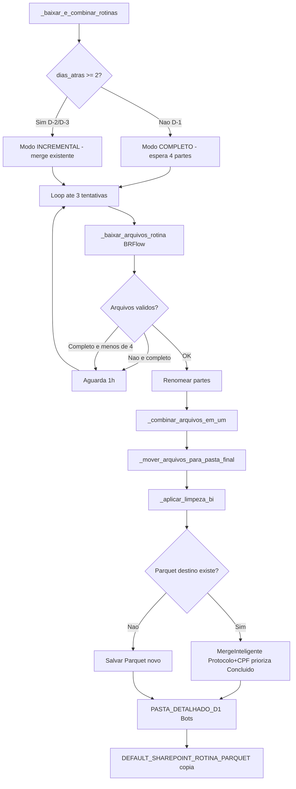

### 3.1 Consolidação das partes (`_combinar_arquivos_em_um` → `_processar_arquivos_do_dia`)

| Etapa | Função | O que faz |
|-------|--------|-----------|
| Agrupamento | `_agrupar_arquivos_por_data` | Agrupa CSVs pelo prefixo `YYYYMMDD` no nome |
| Leitura | `_ler_arquivo_csv_robusto` | Tenta múltiplos encodings/separadores via `CSVReader` |
| Correção | `_corrigir_colunas_dataframe` | Remove BOM, corrige CSV de 1 coluna, força `EXPECTED_COLUMNS` (13 colunas) |
| Dedup interna | `_processar_arquivos_do_dia` | Se múltiplas partes: remove duplicatas por `Protocolo + CPF` **entre as partes** |
| Salvamento temp | `_salvar_arquivo_consolidado` | Gera `YYYYMMDD.csv` na pasta temporária |

**Colunas esperadas (`EXPECTED_COLUMNS`):** Protocolo, Cliente, Workflow, CPF, Data de Cadastro, Data de Conclusão, Status do Registro, Resultado, Nível Hierárquico, matrícula, Data da Primeira Conclusão, Data de Análise, Alertas.

> A deduplicação definitiva **não** ocorre aqui — ocorre no merge com o Parquet existente, para considerar dados antigos + novos juntos.

### 3.2 Limpeza BI (`_aplicar_limpeza_bi`)

Aplicada **somente** nos dados novos antes do merge:

1. **Remove colunas:** Tempo de Análise, Usuário, N. do Contrato/Proposta, Tipo de Conclusão de Análise
2. **Coluna `matrícula`:** converte para flag `0` (corporativo: padrão `c` + dígitos + letra) ou `1` (demais)
3. **Coluna `Alertas`:** mantém apenas alertas com padrão `GC - 9U1ZD6WWXU`; demais viram `NA`

### 3.3 Merge inteligente (`MergeInteligente`)

Chave de deduplicação: **`Protocolo + CPF`** (normalizados: uppercase, sem pontos/hífens).

| Prioridade | Cenário | Resultado |
|------------|---------|-----------|
| 1 | Novo = Concluído, Antigo = Em análise | Mantém **novo** |
| 2 | Novo = Em análise, Antigo = Concluído | Mantém **antigo** |
| 3 | Ambos Concluído ou ambos Em análise | Mantém o **mais recente** (maior índice) |
| 4 | Outros status | Mantém o **mais recente** |

**Saída:** `{PREFIXO_DETALHADO_FINAL}{YYYYMMDD}.parquet` em `PASTA_DETALHADO_D1` (Bots), com cópia em `DEFAULT_SHAREPOINT_ROTINA_PARQUET`. Antes da limpeza BI, grava `{PREFIXO_DETALHADO_BRUTO}{YYYYMMDD}.parquet` em `PASTA_DETALHADO_BRUTO`.

---

## 4. Sub-fluxo: Produtividade D-1

### 4.1 Pré-tratamento na extração (`_baixar_produtividade_d1`)

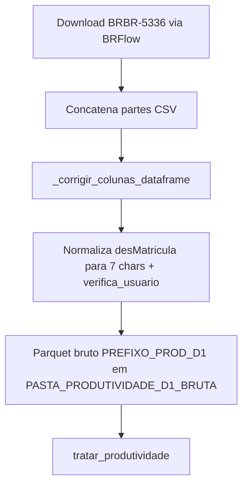

**Validação de matrícula (`verifica_usuario`):** regex `^c\d+[a-z]$` — ex.: `c91123a`.

### 4.2 Tratamento horário (`tratar_produtividade`)

```mermaid
flowchart TD
    TP[tratar_produtividade] --> Read[_ler_csv_tratamento]
    Read --> ValCols{6 colunas obrigatorias?}
    ValCols -->|Nao| Abort[return None]
    ValCols -->|Sim| ParseDate[Parse datAnalise dayfirst]
    ParseDate --> FilterDay[Filtra apenas menor_data do arquivo]
    FilterDay --> Sort[Ordena desMatricula + datAnalise]
    Sort --> CalcFim[datConclusao = datAnalise + numTempoAnalise]
    CalcFim --> Gap[Calcula gap para proxima analise]
    Gap --> ZeroGap[Zera gap se: usuario diferente OU dia diferente OU datConclusao > proxima datAnalise OU gap > 19800s]
    ZeroGap --> Agg[groupby Data+Hora+desMatricula+nomCliente+nomWorkflow+nomEtapa]
    Agg --> SumAgg[tempoAnalise=sum segundos | contagem=count]
    SumAgg --> Save[PREFIXO_PROD_TRATADA YYYYMMDD.parquet]
    Save --> Out[PASTA_PROD_TRATADO]
```

**Colunas de entrada obrigatórias:** `datAnalise`, `numTempoAnalise`, `desMatricula`, `nomCliente`, `nomWorkflow`, `nomEtapa`.

**Colunas de saída:** `Data`, `Hora`, `desMatricula`, `nomCliente`, `nomWorkflow`, `nomEtapa`, `tempoAnalise` (segundos int), `contagem`.

**Regras de gap (entre análises consecutivas do mesmo usuário no mesmo dia):**

| Condição | Ação no gap |
|----------|-------------|
| Próxima linha é de outro usuário ou outro dia | gap = 0 |
| `datConclusao` > `datAnalise` da próxima linha (sobreposição) | gap = 0 |
| gap > 19.800 s (5,5 h) | gap = 0 (não conta como ociosidade) |

> O gap é calculado mas **não entra na agregação** — serve apenas para zerar intervalos inválidos antes do `groupby`. O tempo agregado é a soma de `numTempoAnalise` por hora (inclui linhas com tempo zero).

---

## 5. Sub-fluxo: Monitor de Eventos — núcleo do tratamento

### 5.1 Extração e gate de tratamento

```mermaid
flowchart TD
    DL[_baixar_monitor_eventos_d1] --> Nav[Navega Monitor BRFlow filtra D-1]
    Nav --> SaveBruto[Salva PREFIXO_MONITOR_BRFLOW_BRUTO YYYYMMDD]
    SaveBruto --> Gate{Prod D-1 bruta existe?}
    Gate -->|Nao| SkipTrat[Bruto em disco — sem hook de sync]
    Gate -->|Sim| Pre[_pretratar_monitor_verifica_usuario]
    Pre --> TA[tratar_arquivo]
    TA --> Hook[ROTINA_BRUTO_SAVED|monitor|brflow-monitor-tratado_YYYYMMDD.parquet]
    TA --> Conv[Converte bruto CSV para Parquet local se necessario]
```

**Pré-tratamento (`_pretratar_monitor_verifica_usuario`):**
- Extrai matrícula: primeiros 7 chars antes de `" - "` no campo `Usuário`
- Remove linhas com matrícula inválida (`verifica_usuario`)
- Sobrescreve o arquivo bruto (CSV ou Parquet)

### 5.2 Tratamento de sessões (`tratar_arquivo`)

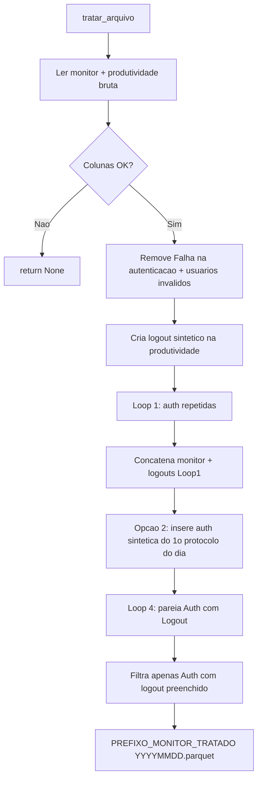

#### Colunas exigidas

| Fonte | Colunas |
|-------|---------|
| Monitor | `Usuário`, `Data do Evento`, `Evento`, `ID Sessão`, `Objeto` |
| Produtividade | `numTempoAnalise`, `datAnalise`, `desMatricula` |

#### Normalização da produtividade (logout sintético)

Para cada linha de produtividade:

1. `DataProtocolo` = horário original de `datAnalise`
2. `Data do Evento` = `datAnalise` + `numTempoAnalise` (fim da análise)
3. Cap em `23:59:59` do dia do protocolo (não vira dia seguinte)
4. `Evento` = `"Logout"`, `ID Sessão` = `"Detalhado Produtividade"`

#### Loop 1 — autenticações repetidas consecutivas

Detecta sequências onde `Evento == "Autenticação com sucesso"` e o evento anterior também é auth.

Para cada ocorrência:
- Busca na produtividade o **logout sintético mais próximo anterior** ao horário da auth repetida
- Se encontrar: adiciona o logout + a auth ao `final_result`
- Se não: vai para `sem_correspondencia`

Resultado do Loop 1: apenas linhas `Logout` da produtividade, depois concatenadas com o monitor.

#### Loop 1b — logouts consecutivos (sem Auth entre L1 e L2)

Detecta sequências onde `Evento == "Logout"` e o evento anterior também é logout (mesmo usuário).

Para cada par `(L1, L2)`:
- Busca o **primeiro `datAnalise`** da produtividade no intervalo aberto `(L1, L2)`
- Se encontrar: insere Auth sintética nesse horário (`ID Sessão = "Produtividade Auth"`)
- Se não: ignora (anti-fantasma)
- **Não reatribui L1** nem descarta sessões curtas anteriores a L1

Reserva opcional no Loop 4: logout L2 só pareia com a Auth sintética do par.

#### Opção 2 — primeira auth do dia (madrugada)

Para cada `(Usuário, Dia)`:
1. Identifica o **primeiro evento do monitor** no dia (exclui linhas `Detalhado Produtividade`)
2. Busca protocolos de produtividade no **mesmo dia** e **antes** desse primeiro evento
3. Se não existe auth antes do primeiro evento do monitor → cria auth sintética no horário do **primeiro protocolo** do dia
4. Marca com `ID Sessão = "Produtividade Inicial"`

#### Loop 4 — pareamento Auth → Logout

Para cada `Autenticação com sucesso`:

```
janela = (data_auth, proxima_auth_do_mesmo_usuario)
fim_do_dia = 23:59:59 do dia da auth
```

| Prioridade | Fonte | Regra |
|------------|-------|-------|
| 1 | Monitor | Primeiro `Logout` real na janela (exclui `Detalhado Produtividade`); cap em `fim_do_dia` |
| 2 | Snapshot H/H | Na última sessão ainda ativa do dia corrente, usa o horário da extração; não confunde fim da produtividade com logout |
| 3 | Produtividade | Último logout sintético na janela; **exige** protocolo real na janela (anti-fantasma) |
| — | Nenhuma | Sessão descartada |

#### Schema de saída

| Coluna | Conteúdo |
|--------|----------|
| `Data` | date da auth |
| `Hora` | hour da auth |
| `Usuário` | matrícula 7 chars |
| `Data do Evento` | datetime da auth |
| `Evento` | sempre `"Autenticação com sucesso"` |
| `Data segundo evento` | datetime do logout |
| `Segundo evento` | sempre `"Logout"` |

**Destino:** `PASTA_MONITOR_TRATADO` / `{PREFIXO_MONITOR_TRATADO}{YYYYMMDD}.parquet`

---

## 6. Sub-fluxo: Confer Produção

### 6.1 Extração (`_baixar_relatorio_producao_confer`)

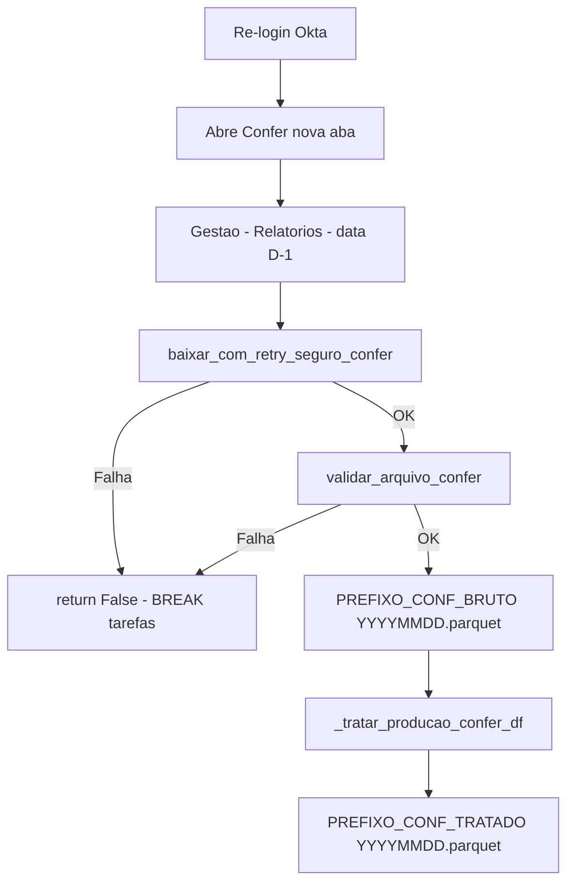

### 6.2 Tratamento (`_tratar_producao_confer_df`)

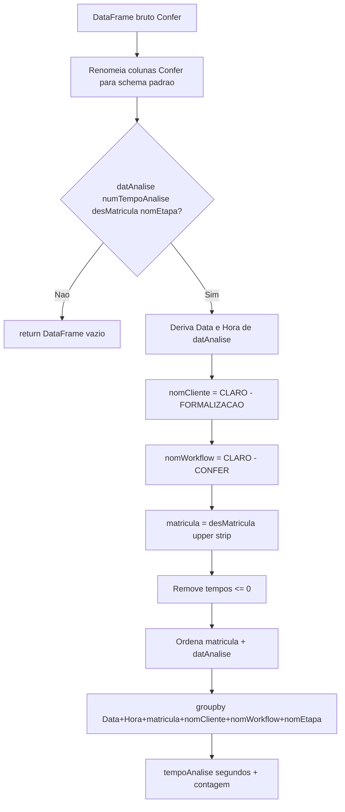

**Mapeamento de colunas Confer → schema interno:**

| Coluna Confer | Coluna tratada |
|---------------|----------------|
| Data/Hora da Conferência | `datAnalise` |
| Tempo de Análise | `numTempoAnalise` |
| Matrícula do Colaborador | `desMatricula` → `matricula` |
| Etapa | `nomEtapa` |

**Diferença vs produtividade BRFlow:** Confer **não aplica** lógica de gap — apenas soma tempos por hora. Cliente e workflow são fixos (`CLARO - FORMALIZAÇÃO` / `CLARO - CONFER`).

**Destinos:**
- Bruto: `PASTA_PRODUCAO_CONFER` / `{PREFIXO_CONF_BRUTO}{YYYYMMDD}.parquet`
- Tratado: `PASTA_PRODUCAO_CONFER_TRATADO` / `{PREFIXO_CONF_TRATADO}{YYYYMMDD}.parquet`

### 6.3 Busca protocolo — Reclassificação (mensal)

Após salvar o bruto diário, `_consolidar_busca_protocolo_confer_mes` reconstrói o CSV mensal a partir de **todos** os brutos do mês (`confer-prod-bruto_YYYYMM*.parquet`).

```mermaid
flowchart TD
    BrutoDiario[confer-prod-bruto_YYYYMMDD.parquet] --> Consol[_consolidar_busca_protocolo_confer_mes]
    Consol --> Glob[glob brutos YYYYMM]
    Glob --> Merge[pd.concat]
    Merge --> Filt[_tratar_busca_protocolo_confer_df]
    Filt --> Etapa{Etapa = Reclassificação?}
    Etapa -->|Sim| Cols[Seleciona e renomeia colunas]
    Cols --> SaveCsv[confer-buscarpIrregularidade-tratado_YYYYMM.csv]
    Cols --> SaveXlsx[confer-buscarpIrregularidade-tratado_YYYYMM.xlsx]
    SaveCsv --> Hook[ROTINA_BRUTO_SAVED|confer_busca|path]
    SaveCsv --> Bots[PASTA_CONFER_BUSCAR_PROTOCOLO_TRATADO]
    SaveXlsx --> Ger[PASTA_BUSCA_PROTOCOLOS_GERENCIAL]
```

**Filtro:** apenas linhas com `Etapa == "Reclassificação"`.

**Colunas de saída (remove `Data/Hora do Cadastro`):**

| Origem | Saída |
|--------|-------|
| Data/Hora da Conferência | Data/Hora da Conferência |
| Tempo de Análise | Tempo por minuto |
| Protocolo | Protocolo |
| Status | Status |
| Ilha | Ilha |
| Etapa | Etapa |
| Matrícula do Colaborador | Matrícula |
| Nome do Colaborador | Nome |
| Tipo/Status conferencia | Tipo/Status conferencia |

**Destinos:**
- Bots (CSV): `PASTA_CONFER_BUSCAR_PROTOCOLO_TRATADO` / `confer-buscarpIrregularidade-tratado_YYYYMM.csv`
- Gerencial (XLSX): `PASTA_BUSCA_PROTOCOLOS_GERENCIAL` / `confer-buscarpIrregularidade-tratado_YYYYMM.xlsx`

**Observação:** independente do tratamento horário (`confer-prod-tratado`) usado pelo prod-unificado.

**Sync PostgreSQL:** após o CSV em Bots, emite `ROTINA_BRUTO_SAVED|confer_busca|…` → tabela `rotina_confer_busca_record` (partição mensal `report_date`).

---

## 7. Sub-fluxo: Log Eventos Confer (`log_eventos`)

### 7.1 Orquestração por matrícula

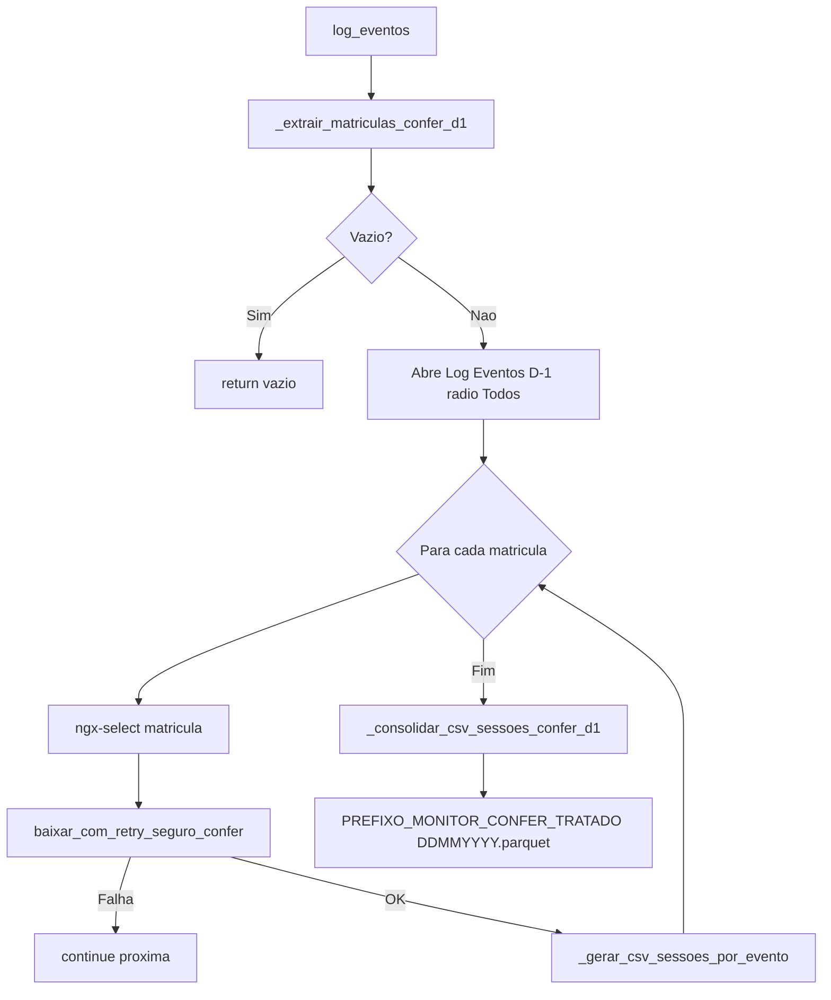

**Fonte das matrículas:** parquet de produção Confer bruto D-1 (`_extrair_matriculas_confer_d1`).

### 7.2 Geração de sessões (`_gerar_csv_sessoes_por_evento`)

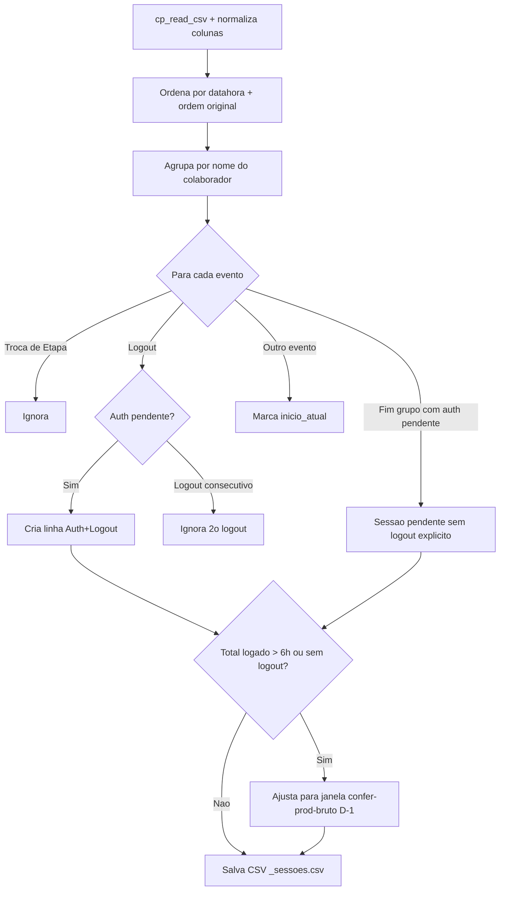

**Lógica de pareamento por grupo (nome do colaborador):**

1. Ignora eventos contendo `"troca de etapa"`
2. Ao encontrar `logout`:
   - Se há `inicio_atual` pendente → cria sessão (auth renomeada para `"Autenticação com sucesso"`, logout = `"Logout"`)
   - Se logout consecutivo → ignora o segundo
3. Ao final do grupo, se sobrou `inicio_atual` → sessão pendente (sem logout forçado)

**Schema de cada sessão gerada:**

| Coluna | Origem |
|--------|--------|
| `Data` | data do evento de início |
| `Hora` | hora do início |
| `matricula` | parâmetro ou coluna do CSV |
| `Data do Evento` | datetime início |
| `Evento` | `"Autenticação com sucesso"` |
| `Data segundo evento` | datetime logout |
| `Segundo evento` | `"Logout"` ou vazio (pendente) |

### 7.3 Filtro de 6 horas e janela confer-prod-bruto

Carregado via `_carregar_janelas_confer_prod_bruto_d1()` — para cada matrícula, obtém `(primeiro_registro, ultimo_registro)` do confer-prod-bruto D-1.

| Situação | Ação |
|----------|------|
| Sessão sem logout explícito | Usa `ultimo_registro` da janela como logout |
| Total logado > 6 h | Ajusta início/fim para interceptar a janela |
| Sessão fora da janela | Descartada |
| Sessão intercepta janela | `novo_inicio = max(inicio, janela_inicio)`, `novo_fim = min(fim, janela_fim)` |

### 7.4 Consolidação (`_consolidar_csv_sessoes_confer_d1`)

- Concatena todos os `*_sessoes.csv` das matrículas
- Ordena por `matricula`, `Data do Evento`
- Salva: `PASTA_MONITOR_CONFER_TRATADO` / `{PREFIXO_MONITOR_CONFER_TRATADO}{DDMMYYYY}.parquet`

> Na task `log_eventos`, após consolidar, chama automaticamente `_juntar_confer_prod_tratados_dia`.

---

## 8. Sub-fluxos de unificação (sem Selenium)

### 8.1 Prod-Unificado (`_juntar_confer_prod_tratados_dia`)

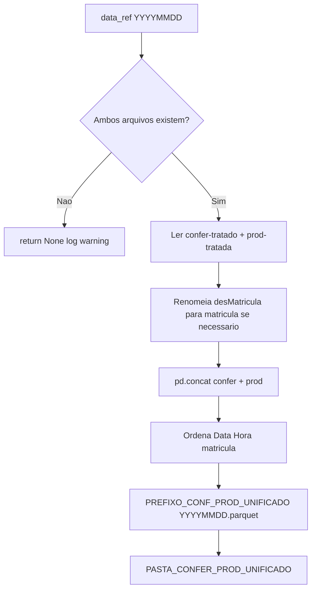

| Entrada | Arquivo |
|---------|---------|
| Confer tratado | `PASTA_PRODUCAO_CONFER_TRATADO` / `{PREFIXO_CONF_TRATADO}{YYYYMMDD}.parquet` |
| Prod tratada | `PASTA_PROD_TRATADO` / `{PREFIXO_PROD_TRATADA}{YYYYMMDD}.parquet` |
| Saída | `PASTA_CONFER_PROD_UNIFICADO` / `{PREFIXO_CONF_PROD_UNIFICADO}{YYYYMMDD}.parquet` |

**Operação:** `concat` vertical (empilha linhas) — não é join por chave. Schemas compatíveis: `Data`, `Hora`, `matricula`, `nomCliente`, `nomWorkflow`, `nomEtapa`, `tempoAnalise`, `contagem`.

### 8.2 Monitor-Unificado (`_juntar_monitor_tratado_com_monitor_confer_dia`)

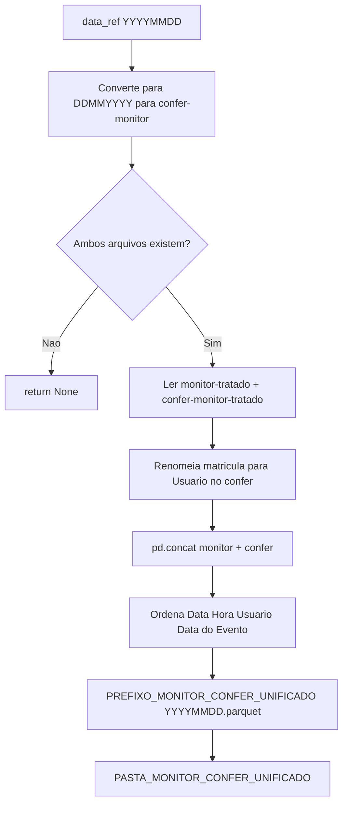

| Entrada | Arquivo |
|---------|---------|
| Monitor BRFlow tratado | `PASTA_MONITOR_TRATADO` / `{PREFIXO_MONITOR_TRATADO}{YYYYMMDD}.parquet` |
| Monitor Confer tratado | `PASTA_MONITOR_CONFER_TRATADO` / `{PREFIXO_MONITOR_CONFER_TRATADO}{DDMMYYYY}.parquet` |
| Saída | `PASTA_MONITOR_CONFER_UNIFICADO` / `{PREFIXO_MONITOR_CONFER_UNIFICADO}{YYYYMMDD}.parquet` |

**Atenção:** formatos de data diferem entre as fontes (`YYYYMMDD` vs `DDMMYYYY`). A função converte internamente.

**Operação:** `concat` vertical. Coluna unificadora: `Usuário` (monitor BRFlow) / `matricula` (confer, renomeada).

### 8.3 Replicados D1 — conferência (`replicacao_aud_d1_conferencia`)

Após salvar `brflow-replicadosd1-tratado_YYYYMMDD.csv`, `_gerar_conferencia_replicados_d1` compara protocolos da aba **Plano** do relatório Excel de replicação com a coluna **Protocolo Origem** do CSV.

**Fonte dos relatórios:** bot principal **Replicação de Auditoria** (`replicacao_auditoria_d1`), base SharePoint `brflow-auditoria-replic-d1/`. A rotina **não** lê mais arquivos de `brflow-auditoria-replic/` (bot legado).

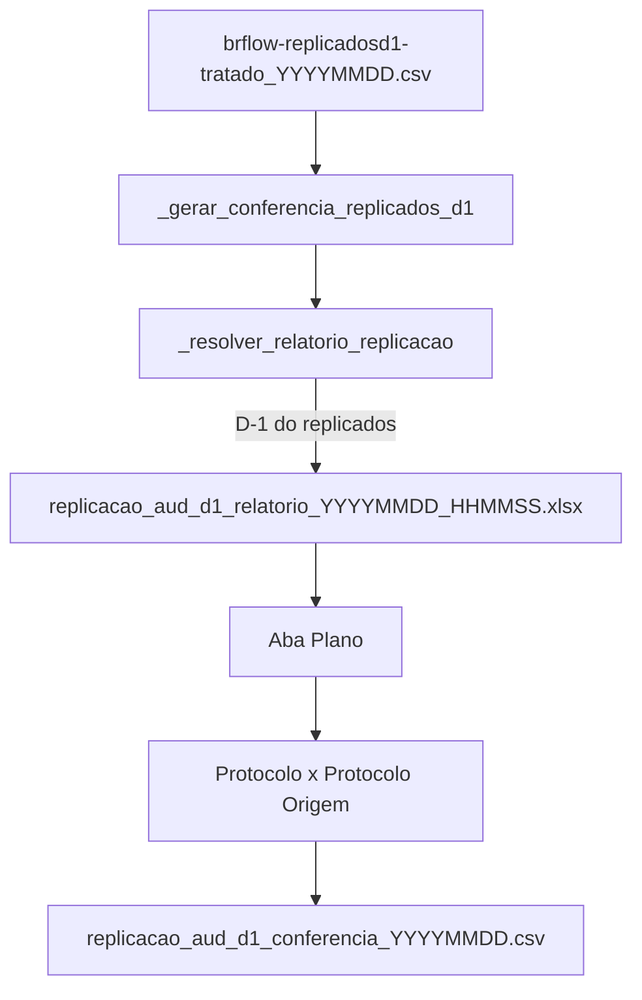

**Relatório de entrada:** `PASTA_REPLICACAO_AUD_D1_RELATORIOS` (`brflow-auditoria-replic-d1/resumo/relatorios/`) ou fallback em `PASTA_REPLICACAO_AUD_D1_RESUMO`, padrões `replicacao_aud_d1_relatorio_{D-1}_*.xlsx` e `replicacao_aud_d1_relatorio_{D-1}.xlsx` (data = D-1 do CSV replicados).

**Saída:** `PASTA_REPLICACAO_AUD_D1_CONFIRMED` (`brflow-auditoria-replic-d1/resumo/confirmed/`) / `replicacao_aud_d1_conferencia_YYYYMMDD.csv` com colunas `Protocolo`, `Status` (REPLICADO/FALTANTE), referências ao relatório e ao CSV replicados.

**Migração:** conferências geradas antes da troca para D-1 ficam em `brflow-auditoria-replic/resumo/confirmed/` com prefixo `replicacao_aud_conferencia_`. Para reprocessar, use `--force` no script abaixo.

**Reprocessamento em lote (offline):**

```bash
python app/scripts/reprocessar_conferencia_replicados.py
python app/scripts/reprocessar_conferencia_replicados.py --data 20260610
python app/scripts/reprocessar_conferencia_replicados.py --force
```

Falha na conferência **não invalida** o download do replicados D-1 (CSV permanece salvo).

### 8.4 Auditoria etapas (sem tratamento de negócio)

`_baixar_auditoria_etapas` apenas:
1. Baixa CSV via BRFlow (`correspondencia_exata=True`)
2. Salva CSV em `PASTA_GAUDITORIA_ROTINAS` / `{YYYYMMDD}.csv`
3. Converte para Parquet com `_preparar_dataframe_para_parquet`
4. Salva em `PASTA_AUDITORIA_TRATADO` / `{PREFIXO_AUDITORIA}{YYYYMMDD}.parquet`

Não há agregação, merge ou limpeza BI.

---

## Apêndice: mapa de arquivos por tratamento

| Tratamento | Prefixo | Primário (Bots) | Cópia gerencial | Data |
|------------|---------|-----------------|-----------------|------|
| Detalhado bruto | `brflow-detalhado-bruto_` | `PASTA_DETALHADO_BRUTO` | — | YYYYMMDD |
| Detalhado BRBR-4467 | `brflow-detalhado-tratado_` | `PASTA_DETALHADO_D1` | `DEFAULT_SHAREPOINT_ROTINA_PARQUET` | YYYYMMDD |
| Produtividade bruta | `brflow-prod-bruto_` | `PASTA_PRODUTIVIDADE_D1_BRUTA` | — | YYYYMMDD |
| Produtividade tratada | `brflow-prod-tratado_` | `PASTA_PROD_TRATADO` | — | YYYYMMDD |
| Monitor bruto | `brflow-monitor-bruto_` | `PASTA_MONITOR_BRUTA` | — | YYYYMMDD |
| Monitor tratado | `brflow-monitor-tratado_` | `PASTA_MONITOR_TRATADO` | — | YYYYMMDD |
| Auditoria (parquet) | `brflow-gauditoria_tratado_` | `PASTA_AUDITORIA_TRATADO` | — | YYYYMMDD |
| Replicados D1 | `brflow-replicadosd1-tratado_` | `PASTA_AUDITORIA_REPLICADOS_D1` | — | YYYYMMDD |
| Conferência replicados | `replicacao_aud_d1_conferencia_` | `PASTA_REPLICACAO_AUD_D1_CONFIRMED` (`brflow-auditoria-replic-d1/resumo/confirmed/`) | — | YYYYMMDD |
| Confer prod bruto | `confer-prod-bruto_` | `PASTA_PRODUCAO_CONFER` | — | YYYYMMDD |
| Confer prod tratado | `confer-prod-tratado_` | `PASTA_PRODUCAO_CONFER_TRATADO` | — | YYYYMMDD |
| Confer busca protocolo | `confer-buscarpIrregularidade-tratado_` | `PASTA_CONFER_BUSCAR_PROTOCOLO_TRATADO` (CSV) | `PASTA_BUSCA_PROTOCOLOS_GERENCIAL` (XLSX) | YYYYMM |
| Confer monitor tratado | `confer-monitor-tratado_` | `PASTA_MONITOR_CONFER_TRATADO` | — | DDMMYYYY |
| Prod unificado | `prod-unificado_` | `PASTA_PROD_UNIFICADO_BOTS` | `PASTA_CONFER_PROD_UNIFICADO` | YYYYMMDD |
| Monitor unificado | `monitor-unificado_` | `PASTA_MONITOR_UNIFICADO_BOTS` | `PASTA_MONITOR_CONFER_UNIFICADO` | YYYYMMDD |
| Irregularidade GED | `ged-irregularidade-tratado_` | `PASTA_GED_IRREGULARIDADE_TRATADO` | `PASTA_INDICADOR_QUALIDADE` | YYYYMM_1\|2 |
| GED detalhado (bot GED) | `ged-detalhado-tratado_` | `PASTA_GED_TRATADO` (parquet) | `PASTA_GED_PARQUET_ONEDRIVE` (parquet) + `PASTA_GED_CSV_GED20` / `GED 2.0` (CSV `;` cp1252) | YYYYMM ou YYYYMM_N |

### Sync PostgreSQL (`apps.rotina_bruto`)

| report_type | Arquivo | Tabela | Partição |
|-------------|---------|--------|----------|
| `detalhado` | `brflow-detalhado-bruto_YYYYMMDD.parquet` | `rotina_detalhado_bruto_record` | `report_date` (dia) |
| `prod` | `brflow-prod-bruto_YYYYMMDD.parquet` | `rotina_prod_bruto_record` | `report_date` (dia) |
| `monitor` | `brflow-monitor-tratado_YYYYMMDD.parquet` | `rotina_monitor_tratado_record` | `report_date` (dia) |
| `confer_busca` | `confer-buscarpIrregularidade-tratado_YYYYMM.csv` | `rotina_confer_busca_record` | `report_date` (mês) |
| `ged_detalhado` | `ged-detalhado-tratado_YYYYMM.parquet` (ou `_N`) | `rotina_ged_detalhado_tratado_record` | `report_date` + `periodo` |
| `ged_irregularidade` | `ged-irregularidade-tratado_YYYYMM_N.csv` | `rotina_ged_irregularidade_tratado_record` | `report_date` + `periodo` |

Carga histórica: `python manage.py sync_rotina_bruto --all-types --force` (seis pastas no `backend/.env`).

---

## 9. Política de erros (resumo)

| Nível | Comportamento |
|-------|---------------|
| Tarefa individual | `try/except` → `_registrar_erro` → **continua** próxima tarefa |
| Confer produção falha | `break` → interrompe log_eventos e unificados do dia |
| BRBR-4467 D-1 incompleto | Até 3 retries com 1h de espera; após isso desiste |
| Selenium global | Screenshot + notificação Teams erro |
| Matrícula Log Eventos | Falha isolada → `continue` para próxima matrícula |
| Agendador | Erro → Teams + sleep 5min + retry |

---

## 10. Dependências externas

- **Web:** Okta SSO, BRFlow (rotinas + monitor), Confer (produção + log eventos)
- **Selenium:** `selenium_helpers` (`create_driver`, `login_okta_resiliente`, etc.)
- **Arquivos:** SharePoint/OneDrive via paths em [`app/config/paths.py`](../app/config/paths.py)
- **Notificações:** `Teams.notify`
- **Sem banco de dados** — persistência em CSV/Parquet
