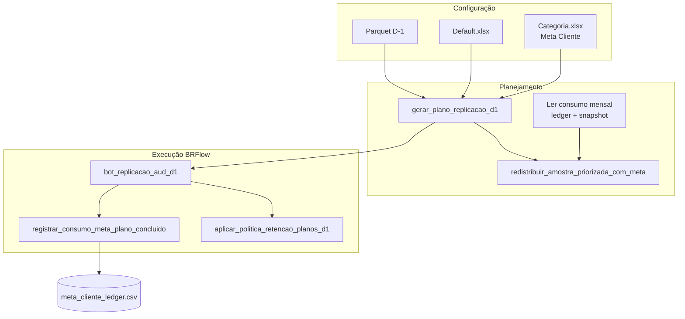
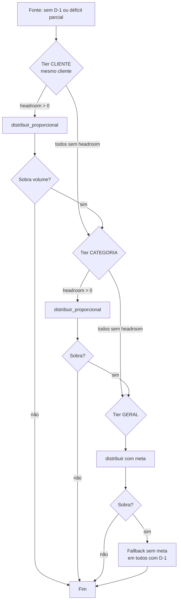

# Replicação de Auditoria (D-1) — Meta mensal por cliente e retenção de planos

Documentação das funcionalidades de **meta mensal por cliente** (redistribuição inteligente) e **limpeza automática de planos** no bot principal de replicação de auditoria.

**Escopo:** mode `replicacao_auditoria_d1` — label na UI: **Replicação de Auditoria** (volumetria do parquet D-1).

> **Configuração no PostgreSQL:** ver [`replicacao-aud-d1-config-banco.md`](replicacao-aud-d1-config-banco.md). Com `fonte_banco_ativa=True`, cadastros e ledger passam a ser lidos/gravados no banco; este documento descreve a semântica de negócio (válida para planilha ou banco).

> **Bot legado:** o mode `replicacao_auditoria` (*Replicação de Auditoria (legado)*) permanece na seção **Legados** da interface, com pasta própria em `brflow-auditoria-replic/`. Não é usado pela rotina diária nem por este documento.

**Código principal:**

| Módulo | Responsabilidade |
|--------|------------------|
| [`app/bots/replicacao_aud_d1_planning.py`](../app/bots/replicacao_aud_d1_planning.py) | Planejamento, redistribuição com meta, limpeza de planos |
| [`app/bots/meta_cliente_mensal.py`](../app/bots/meta_cliente_mensal.py) | Ledger e snapshot do consumo mensal |
| [`app/bots/replicacao_aud_planning.py`](../app/bots/replicacao_aud_planning.py) | Leitura de `Categoria.xlsx` (inclui meta) |
| [`app/bots/bot_replicacao_aud_d1.py`](../app/bots/bot_replicacao_aud_d1.py) | Execução BRFlow + registro de consumo + limpeza pós-run |
| [`app/config/paths.py`](../app/config/paths.py) | Pastas, prefixos e constantes |

---

## 1. Visão geral

O planejamento D-1 calcula, por workflow, quantos protocolos auditar no dia com base no parquet D-1, `Default.xlsx` e `Categoria.xlsx`. Parte desse volume pode ser **redistribuída** quando:

- um workflow **não tem registros** no parquet D-1;
- um workflow fica **parcial** (volume disponível menor que a amostra solicitada).

A redistribuição segue prioridade **Cliente → Categoria → Geral**, proporcional à amostra de cada workflow destino.

Com a meta mensal, cada **cliente** pode ter um teto mensal configurado. Esse teto **não corta** a amostra base do workflow (`amostra_ajustada`), mas limita quanto o cliente pode receber de **bônus redistribuído** no mês. O consumo é persistido entre execuções.

Planos antigos (CSVs, JSON de estado, relatórios Excel) podem ser removidos automaticamente para não acumular disco.



---

## 2. Estrutura de pastas (D-1)

Base padrão (SharePoint local / `DEFAULT_SHAREPOINT_BOTS`):

```
brflow-auditoria-replic-d1/
├── config/
│   ├── Default.xlsx              # Workflows, calculadora, mapa D-1
│   ├── Categoria.xlsx            # Cliente, Segmento, Categoria, Meta Cliente
│   ├── escala/
│   │   └── escala_auditores.csv
│   ├── meta_cliente_ledger.csv   # Histórico de consumo (fonte da verdade)
│   └── meta_cliente_mensal.csv   # Snapshot rápido por mês/cliente
├── protocolos/
│   └── {run_id}/                 # Um CSV por workflow
│       └── {workflow}.csv
    └── resumo/
        ├── execucao_d1_{run_id}.json # Estado da execução (retomada)
        ├── relatorios/
        │   └── replicacao_aud_d1_relatorio_{run_id}.xlsx
        └── confirmed/                # Conferência rotina (replicacao_aud_d1_conferencia_*.csv)
```

Constantes em [`app/config/paths.py`](../app/config/paths.py): `PASTA_REPLICACAO_AUD_D1_*`, `REPLICACAO_AUD_D1_*_PREFIXO`.

### 2.1 Modo amostra 100% por workflow

Alguns workflows podem ser configurados para **ignorar a amostra estatística** e replicar **100% dos protocolos disponíveis** no parquet D-1.

**Onde configurar:** campo **Workflows amostra 100%** na configuração do bot na UI (`robot_config.replicacao_workflows_amostra_100`): lista suspensa com seleção múltipla (Ctrl/Cmd + clique), populada a partir do `Default.xlsx`. Valores salvos como array de nomes da coluna **Workflow** (aba Workflow d1).

**Comportamento:**

| Aspecto | Regra |
|---------|--------|
| Seleção | Todos os protocolos únicos do workflow no D-1, **sem amostragem aleatória** |
| Histórico | Respeita `excluir_historico` / `dias_historico` (protocolos já replicados são excluídos) |
| Escala de auditores | Ignorada para workflows em modo 100% |
| Redistribuição | Workflows 100% **não recebem** bônus e **não entram** como destino na redistribuição |
| Sem D-1 | Aviso no plano; CSV vazio (modo 100% inaplicável) |
| Relatório | `Amostra Solicitada` = `100%`; observação inclui `Modo 100%` |

**Matching:** nomes são normalizados com `_normalizar_workflow` (mesma regra do merge config). Workflows listados na UI mas ausentes do plano geram aviso, sem interromper a execução.

Funções: `carregar_workflows_amostra_100()` e `selecionar_todos_protocolos()` em [`replicacao_aud_planning.py`](../app/bots/replicacao_aud_planning.py).

---

## 3. Meta mensal por cliente

### 3.1 Configuração — `Categoria.xlsx`

A meta é **por workflow**, mas configurada **por cliente** em `Categoria.xlsx` (cada workflow do cliente herda o mesmo valor).

Coluna obrigatória para meta (aceita aliases na leitura):

| Nome preferencial | Aliases aceitos |
|-------------------|-----------------|
| **Meta Cliente** | Meta, Meta Mensal, meta, meta mensal |

| Coluna | Descrição |
|--------|-----------|
| Cliente | Nome do cliente (deve bater com `Default.xlsx` / volumetria) |
| Segmento | Segmento do cliente |
| Categoria | Categoria (usada na redistribuição tier 2) |
| **Meta Cliente** | **Volume mensal absoluto por workflow** (ex.: `500`) — mesmo valor para todos os workflows do cliente |

**Unidade:** número inteiro = quantidade máxima de protocolos que **cada workflow** pode acumular no mês (redistribuição + contabilização BRFlow).

**Cliente sem meta:** gera aviso no planejamento; workflows desse cliente ficam **sem teto** na redistribuição (headroom ilimitado).

**Validações na carga:**

- Meta numérica ≥ 0
- Aviso se coluna de meta ausente
- Aviso por cliente sem meta preenchida
- Aviso se **soma das metas** diverge da capacidade mensal estimada (`auditores × meta_produ × dias_uteis`) além de `REPLICACAO_META_CLIENTE_TOLERANCIA_SUM` (padrão 50)

Função: `carregar_categoria_clientes()` e `validar_metas_categoria_clientes()` em `replicacao_aud_planning.py`.

### 3.2 O que a meta limita (e o que não limita)

| Conceito | Comportamento |
|----------|----------------|
| **Amostra base** (`amostra_ajustada`) | Aplicada normalmente; o **headroom para redistribuição** considera também a amostra base do run (regra B) |
| **Bônus de redistribuição** | Respeita **headroom mensal** do cliente (após simular consumo base do run) |
| **Consumo oficial** | `Protocolos Salvos` de workflows com status **`SALVO_OK`** no BRFlow |

### 3.3 Headroom mensal (por workflow)

No início de cada planejamento, para **cada workflow**:

```
ano_mes = YYYY-MM (configurável: execução ou data referência D-1)
consumo_acumulado = soma do ledger para ano_mes + workflow
headroom_redistribuicao = max(0, meta_mensal_workflow - consumo_acumulado - amostra_base_run)
```

- Workflow **sem meta** configurada: headroom ilimitado para redistribuição.
- Workflow com **meta = 0** explícita: headroom 0 (não recebe redistribuição).

Chave do workflow: normalização via `_normalizar_workflow` (coluna `Workflow` do config).

### 3.4 Regras de redistribuição

Função: `redistribuir_amostra_priorizada_com_meta()`.

**Fontes de volume a redistribuir:**

1. Workflows **sem D-1** (cota integral da amostra).
2. **Déficit parcial** após seleção de protocolos (`amostra_efetiva - protocolos_salvos`).

**Prioridade (tiers):**

1. **CLIENTE** — workflows com D-1 do mesmo cliente da fonte.
2. **CATEGORIA** — mesma categoria, excluindo os já usados no tier 1.
3. **GERAL** — demais workflows com D-1.

Dentro de cada tier: `distribuir_proporcional` pelos pesos `amostra` dos destinos.

**Regras de meta no tier:**

- Só entram destinos cujo cliente tem `headroom > 0`.
- Se **ninguém** no tier tem headroom → **não aloca nesse tier**; passa ao próximo.
- Se após todos os tiers ainda sobrar volume → redistribuição **final sem filtro de meta** (fallback quando todos bateram meta no mês), salvo se `meta_cliente_fallback_sem_cap=false` (volume vira aviso e não é alocado).
- Bônus de **déficit parcial** usa segunda passagem com `alocar_amostra_por_hora` sobre o pool restante (não `sample` global).
- O workflow **fonte** nunca recebe de volta o próprio déficit.

**Compatibilidade:** `redistribuir_amostra_priorizada()` (sem meta explícita) chama a versão com meta usando headroom ilimitado — testes antigos continuam válidos.

### 3.5 Separação entre balanceamento e análise

O limite mensal, o consumo usado para balanceamento e o saldo interno servem exclusivamente para escolher destinos da redistribuição. Eles não são somados, não representam capacidade produtiva e não compõem KPIs, percentuais, gaps, projeções ou abas do relatório Excel.

A projeção operacional usa apenas consumo realizado, volumetria disponível, amostra calculada e capacidade da escala. O relatório do plano mantém os dados efetivos da execução, como amostra redistribuída e protocolos salvos, sem expor o limite de balanceamento como resultado analítico.

---

## 4. Persistência mensal (ledger + snapshot)

### 4.1 Ledger — `config/meta_cliente_ledger.csv`

**Fonte da verdade.** Formato CSV (`;`, UTF-8 com BOM).

| Coluna | Descrição |
|--------|-----------|
| ano_mes | `YYYY-MM` (data de execução) |
| cliente | Chave normalizada do cliente |
| run_id | ID da execução |
| data_execucao | ISO datetime do registro |
| protocolos | Quantidade contabilizada |
| origem | `confirmado` ou `ajuste_manual` |
| observacao | Texto livre |

**Idempotência:** para `(ano_mes, run_id, origem=confirmado)` o ledger **substitui** a linha agregada do run (upsert), permitindo retomadas parciais do BRFlow.

**Registro incremental:** após cada workflow `SALVO_OK`, `sincronizar_consumo_meta_run()` regrava o total confirmado do run.

**Ao apagar plano:** opção `remover_ledger` remove linhas do run no ledger e recalcula o snapshot (checkbox na UI).

**Quando grava:** ao final da execução BRFlow em `bot_replicacao_aud_d1.py`, via `registrar_consumo_meta_plano_concluido()`:

- Soma `Protocolos Salvos` por cliente no resumo.
- Considera apenas workflows com status `SALVO_OK` no `execucao_d1_{run_id}.json`.

### 4.2 Snapshot — `config/meta_cliente_mensal.csv`

Leitura rápida no planejamento. Recalculado após cada registro no ledger.

| Coluna | Descrição |
|--------|-----------|
| ano_mes | `YYYY-MM` |
| cliente | Chave normalizada |
| meta_mensal | Valor de `Categoria.xlsx` |
| consumo_acumulado | Soma do ledger no mês |
| headroom | `max(0, meta_mensal - consumo_acumulado)` |
| atualizado_em | Timestamp da última atualização |

### 4.3 API interna (`meta_cliente_mensal.py`)

| Função | Uso |
|--------|-----|
| `ano_mes_de_data(data)` | Chave `YYYY-MM` |
| `carregar_consumo_meta_mensal(ano_mes)` | Consumo por cliente |
| `carregar_metas_por_cliente(df_categorias)` | Metas do Excel |
| `carregar_headroom_meta_mensal(ano_mes, metas)` | Headroom para redistribuição |
| `registrar_consumo_meta_run(...)` | Append idempotente no ledger |
| `recalcular_snapshot_mensal(ano_mes)` | Atualiza snapshot |
| `calcular_consumo_por_cliente_confirmado(plano, estado)` | Consumo do run atual |
| `registrar_consumo_meta_plano_concluido(plano, estado)` | Chamada pós-BRFlow |

### 4.4 Virada de mês

O consumo é filtrado por `ano_mes`. Em `2026-07-01`, o planejamento usa chave `2026-07` e o consumo começa zerado automaticamente (ledger separado por mês).

### 4.5 Ajuste manual

Para corrigir consumo sem apagar histórico, adicione linha manual no ledger com `origem=ajuste_manual` e `run_id` único, depois recalcule o snapshot (próxima execução com meta já recalcula; ou chame `recalcular_snapshot_mensal` via script).

---

## 5. Fluxo operacional recomendado

### 5.1 Primeira configuração

1. Preencher `Categoria.xlsx` com coluna **Meta Cliente** (volume mensal por cliente).
2. Manter `Default.xlsx` e escala de auditores atualizados.
3. Rodar **Apenas planejamento** na UI e validar aba Resumo do Excel (colunas de meta).

### 5.2 Execução diária

1. **Planejamento** (`gerar_plano_replicacao_d1`):
   - Carrega consumo/headroom do mês.
   - Calcula amostras e redistribui com meta.
   - Gera CSVs em `protocolos/{run_id}/`.
   - Gera `execucao_d1_{run_id}.json` e relatório Excel.

2. **Execução BRFlow** (mesmo `run_id`):
   - Upload dos CSVs por workflow.
   - Atualiza status por workflow no JSON de estado.

3. **Pós-execução**:
   - Atualiza relatório Excel com status BRFlow.
   - Registra consumo mensal no ledger (se houver `SALVO_OK`).
   - Opcional: limpa planos antigos (retenção).

### 5.3 Retomada

- Use o mesmo **Run ID** na UI.
- Marque **Apenas pendentes** (padrão).
- O estado em `execucao_d1_{run_id}.json` preserva workflows já concluídos.

---

## 6. Retenção e limpeza de planos

Evita acúmulo de `protocolos/`, JSONs de execução e relatórios Excel.

### 6.1 O que é removido por `run_id`

Função: `apagar_plano_run_d1(run_id)`.

| Artefato | Caminho |
|----------|---------|
| Pasta de protocolos | `protocolos/{run_id}/` |
| Estado de execução | `resumo/execucao_d1_{run_id}.json` |
| Relatório Excel | `resumo/relatorios/replicacao_aud_d1_relatorio_{run_id}.xlsx` |
| Layout antigo em `resumo/` (fallback) | `replicacao_aud_d1_resumo_{run_id}.csv`, `plano_`, `dashboard_`, `relatorio_` na raiz de `resumo/` |

### 6.2 O que NÃO é removido

- `config/meta_cliente_ledger.csv`
- `config/meta_cliente_mensal.csv`
- `config/Default.xlsx`, `Categoria.xlsx`, escala
- `resumo/confirmed/` (conferências por data)

### 6.3 Políticas de retenção

Configuráveis na UI (painel D-1) ou via `robot_config`:

| Setting | Tipo | Default | Descrição |
|---------|------|---------|-----------|
| `limpar_planos_automatico` | bool | `false` | Habilita política automática |
| `manter_planos_ultimos_n` | int | `5` | Mantém os N runs mais recentes (1–50) |
| `dias_retencao_planos` | int | `0` | Apaga runs mais antigos que N dias (`0` = desativado) |
| `limpar_planos_ao_gerar` | bool | `false` | Aplica política antes de gerar novo plano |
| `limpar_planos_apos_conclusao` | bool | `false` | Aplica política após BRFlow (preserva run atual) |

**Proteção:** runs com workflows `PENDENTE` ou `UPLOAD_OK` são **ignorados** (evita apagar execução em andamento). Use `forcar: true` na API para forçar remoção.

Função central: `aplicar_politica_retencao_planos_d1(settings)`.

### 6.4 API REST

**Listar runs:**

```http
GET /api/robots/replicacao-d1/runs?limite=15
```

**Limpar planos:**

```http
POST /api/robots/replicacao-d1/limpar-planos
Content-Type: application/json

{
  "robot_config": { ... },
  "run_ids": ["20260617_093000"],
  "forcar": false,
  "remover_ledger": true
}
```

- Sem `run_ids`: aplica política de retenção (`manter_planos_ultimos_n` + `dias_retencao_planos`).
- Com `run_ids`: apaga apenas os informados.
- `remover_ledger`: remove consumo do run no ledger mensal.

**Controle de balanceamento mensal:**

```http
GET /api/robots/replicacao-d1/meta-mensal?ano_mes=2026-06
POST /api/robots/replicacao-d1/meta-mensal/recalcular
POST /api/robots/replicacao-d1/meta-mensal/ajuste
GET /api/robots/replicacao-d1/runs/{run_id}/ledger
```

O `GET meta-mensal` devolve os saldos operacionais por workflow e uma projeção de consumo baseada no ritmo observado. A projeção não é limitada nem comparada com os limites de balanceamento e não retorna meta total, percentual atingido ou gap.

**Resposta (limpeza):**

```json
{
  "ok": true,
  "message": "2 plano(s) removido(s)",
  "removidos": ["20260615_100000", "20260616_100000"],
  "ignorados": [],
  "erros": []
}
```

### 6.5 UI

No painel **Replicação de Auditoria** (mode `replicacao_auditoria_d1`) → **Pré-voo e execuções**:

- Lista dos **últimos 30 planos** com checkbox por `run_id`
- **Selecionar todos** — marca/desmarca a lista
- **Forçar (mesmo com pendências)** — apaga runs com workflows pendentes
- **Remover consumo do ledger ao apagar** — reverte contabilização mensal dos runs apagados
- **Apagar planos selecionados** — remove só os marcados (confirmação informa runs no ledger)
- Clique no **run_id** na lista preenche o campo Run ID
- **Controle mensal de balanceamento** — tabela de limite, consumo operacional e saldo para redistribuição, com recálculo de saldos e ajuste manual

Em **Retenção de planos**:

- **Limpar planos antigos agora** — aplica política automática (`manter_planos_ultimos_n` / dias)

---

## 7. Configuração na interface web

Além das opções já existentes (escala, seed, histórico de protocolos, etc.), o mode `replicacao_auditoria_d1` expõe:

| Campo UI | Setting JSON |
|----------|--------------|
| Limpar planos antigos automaticamente | `limpar_planos_automatico` |
| Limpar ao gerar novo plano | `limpar_planos_ao_gerar` |
| Limpar após conclusão BRFlow | `limpar_planos_apos_conclusao` |
| Manter últimos N planos | `manter_planos_ultimos_n` |
| Dias de retenção | `dias_retencao_planos` |

Defaults em [`app/services/robot_manager.py`](../app/services/robot_manager.py) → `REPLICACAO_AUD_D1_CONFIG_DEFAULT`.

### 7.1 Agendamento diário (planejamento + execução)

O bot pode rodar em **modo agendado**: um processo longo (iniciado uma vez na UI) executa automaticamente:

1. **Planejamento** no horário configurado (padrão **07:00**) — gera CSVs e relatório sem abrir o BRFlow
2. **Execução BRFlow** no horário configurado (padrão **12:00**) — usa o `run_id` gerado no planejamento do mesmo dia

| Campo UI | Setting JSON | Padrão |
|----------|--------------|--------|
| Ativar agendamento | `agendamento_ativo` | `false` |
| Horário do planejamento | `agendamento_hora_planejamento` | `"07:00"` |
| Horário da execução BRFlow | `agendamento_hora_execucao` | `"12:00"` |

**Código:** [`app/bots/replicacao_aud_d1_orchestration.py`](../app/bots/replicacao_aud_d1_orchestration.py)

**Estado persistido:** `resumo/agendador_d1_state.json` (permite retomar entre 07h e 12h se o processo reiniciar).

**Regras:**

- Timezone: `America/Sao_Paulo`
- Todos os dias (sem filtro de dia útil)
- Se o planejamento falhar, a execução do mesmo dia é **cancelada**
- Se o robô for iniciado **após** o horário do planejamento e o plano do dia ainda não existir, o planejamento roda **imediatamente**
- Com agendamento ativo, os checkboxes manuais *Apenas planejamento* / *Gerar novo plano* são ignorados (controlados pelo agendador)
- A aprovação manual do plano é exigida nas execuções manuais, mas é dispensada na execução automática do agendador
- Execução manual continua disponível com `agendamento_ativo=false`

**Uso:**

1. Configure escala, parquet e `Categoria.xlsx`
2. Ative **Agendamento diário** na config do bot
3. Valide credenciais Okta
4. Clique **Iniciar** — status exibirá contagem regressiva até o próximo horário
5. **Parar** encerra o agendador

---

## 8. Diferença: Meta Produ vs Meta Cliente

| Conceito | Arquivo | Escopo | Uso |
|----------|---------|--------|-----|
| **Meta Produ (diária)** | `Default.xlsx` (Calculadora Padrão) | Global por auditor | Escala diária: `auditores × meta_produ` → capacidade produtiva |
| **Meta Cliente** | `Categoria.xlsx` | Por cliente, **mensal** | Teto soft na redistribuição + controle de consumo acumulado |

São independentes: a meta de produção define quanto o time audita no dia; a meta de cliente distribui redistribuições ao longo do mês.

---

## 9. Diagrama de redistribuição com meta



---

## 10. Testes automatizados

| Arquivo | Cobertura |
|---------|-----------|
| [`tests/test_meta_cliente_mensal.py`](../tests/test_meta_cliente_mensal.py) | Ledger idempotente, headroom, redistribuição com meta, limpeza de planos |
| [`tests/test_replicacao_aud_d1_agendamento.py`](../tests/test_replicacao_aud_d1_agendamento.py) | Agendador diário (horários, state, settings por fase) |

Executar:

```powershell
cd c:\Users\c93123a\PPLIDBOTS
python -m pytest tests/test_meta_cliente_mensal.py tests/test_replicacao_aud_d1_planning.py -q
```

---

## 11. Solução de problemas

### Cliente recebe redistribuição mesmo com meta cheia

- Verifique se **todos** os clientes elegíveis no tier já bateram meta — nesse caso o sistema aplica o **fallback sem cap** (comportamento esperado).
- Confira se o cliente tem meta preenchida em `Categoria.xlsx` (sem meta = ilimitado).

### Consumo mensal não atualiza

- Consumo só registra após BRFlow com workflows em **`SALVO_OK`**.
- Execução só em **planejamento** não grava no ledger.
- Mesmo `run_id` não duplica registro (idempotência).

### Plano não foi apagado na limpeza

- Run ainda tem workflows `PENDENTE` ou `UPLOAD_OK`.
- Run está entre os **N mais recentes** configurados em `manter_planos_ultimos_n`.
- Use o botão manual ou API com `forcar: true` se tiver certeza.

### Aviso "sem limite mensal de balanceamento em Categoria.xlsx"

- Preencha a coluna **Meta Cliente** para o cliente ou aceite redistribuição sem teto para ele.

### Agendador não executou no horário

- Confirme que o robô está **em execução** (processo agendador ativo, não apenas config salva)
- Verifique `resumo/agendador_d1_state.json` — planejamento falho cancela a execução do dia
- Credenciais Okta precisam estar validadas antes de iniciar o agendador

O saldo de balanceamento nunca deve ser interpretado como indicador de desempenho; ele apenas controla quanto um destino ainda pode receber na redistribuição.

---

## 12. Referência rápida de arquivos gerados por execução

| Momento | Arquivo |
|---------|---------|
| Planejamento | `protocolos/{run_id}/*.csv` |
| Planejamento | `resumo/execucao_d1_{run_id}.json` |
| Planejamento | `resumo/relatorios/replicacao_aud_d1_relatorio_{run_id}.xlsx` |
| Pós-BRFlow | Atualização do Excel + ledger (se SALVO_OK) |
| Limpeza | Remoção dos itens acima (preserva ledger) |

---

## 13. Glossário

| Termo | Definição |
|-------|-----------|
| **run_id** | Identificador da execução (ex.: `20260617_093000`) |
| **amostra_ajustada** | Amostra diária após escala de auditores |
| **amostra_efetiva** | Amostra base + bônus redistribuído |
| **headroom** | Quanto o cliente ainda pode receber no mês |
| **ledger** | Histórico append-only de consumo |
| **snapshot** | Resumo derivado do ledger para leitura rápida |
| **tier** | Nível de prioridade na redistribuição (CLIENTE / CATEGORIA / GERAL) |

---

## 14. Retroativo por workflow

Com `fonte_banco_ativa=True`, a config **Retroativo** (portal → Config D-1 → Regras → Retroativo) permite:

1. Selecionar **workflows elegíveis** e um **período global** (máx. 31 dias).
2. No próximo planejamento, **ampliar o pool** dos workflows selecionados com registros da Rotina no intervalo `[data_início, data_fim]`.
3. Manter a **amostra alvo** inalterada (calculadora, escala, histórico, seed e mix manual/automático continuam valendo).

**Regras operacionais:**

- `data_fim` deve ser ≤ `data_ref` do plano; caso contrário o bot ajusta e emite aviso.
- Protocolos retroativos recebem `selection_reason` no formato `retroativo:YYYY-MM-DD` para auditoria (sufixo `:parquet` quando o dia veio do fallback parquet).
- Dedup por `(protocolo_normalizado, workflow)` — registros do D-1 do dia têm prioridade sobre retroativos; entre dias retroativos a chave inclui o dia (`protocolo + workflow + data`).
- **Split fixo 50/50** (workflows elegíveis): metade da amostra efetiva vem do pool do **D-1 de referência**; metade vem do pool **retroativo**, distribuída entre os dias do intervalo (mínimo 1 protocolo por dia com dados quando a cota retroativa permitir).
- Carregamento retroativo via banco é **dia a dia** (`source_rows_for_day_from_rotina`), preservando volume de cada dia no intervalo.
- Workflows **fora** da seleção retroativa continuam 100% no D-1 de referência (dependem da sync Rotina ou `fallback_parquet_dias_ausentes`).
- Desative o toggle ou ajuste o período quando o backlog encerrar.

### Fallback parquet para dias ausentes

Com `fonte_banco_ativa=True`, ative **`fallback_parquet_dias_ausentes`** na config geral quando
a Rotina ainda não tiver sincronizado alguns dias no PostgreSQL. O bot tenta o banco primeiro;
se a partição do dia estiver vazia, usa `brflow-detalhado-tratado_YYYYMMDD.parquet` (dia exato,
sem `fallback_ultimo_parquet`). Aplica-se ao **D-1 de referência** e a **cada dia** do intervalo
retroativo. Dias preenchidos via parquet geram avisos no plano e `selection_reason` com `:parquet`.
---

*Documento gerado para o projeto PPLIDBOTS — bot principal **Replicação de Auditoria** (`replicacao_auditoria_d1`).*
